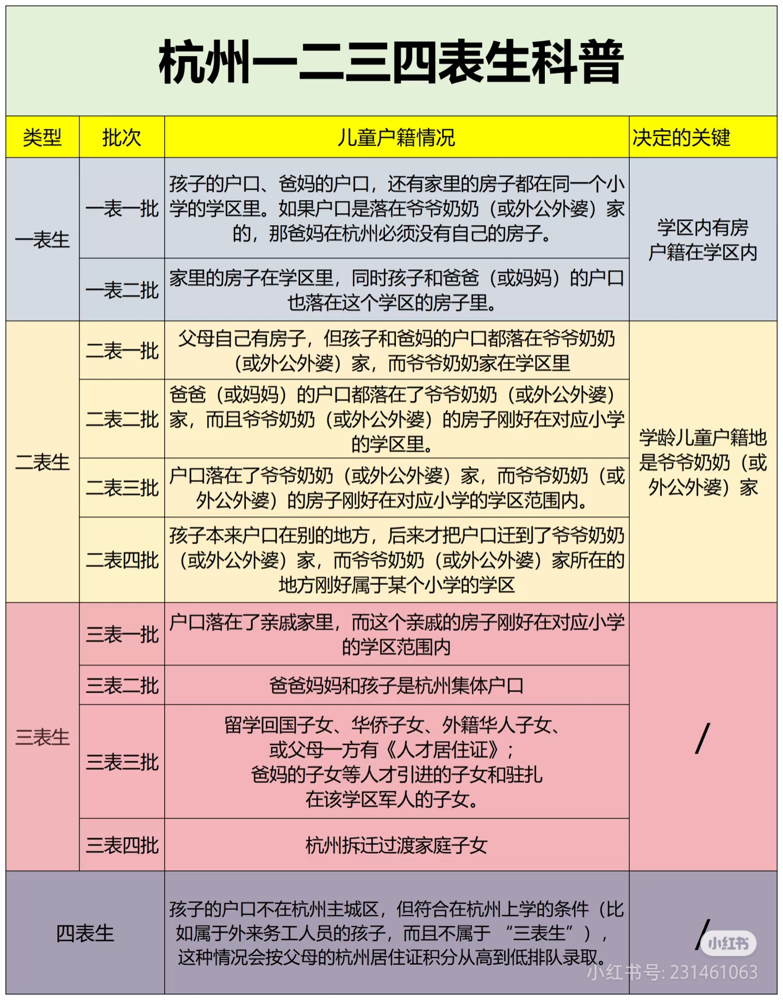
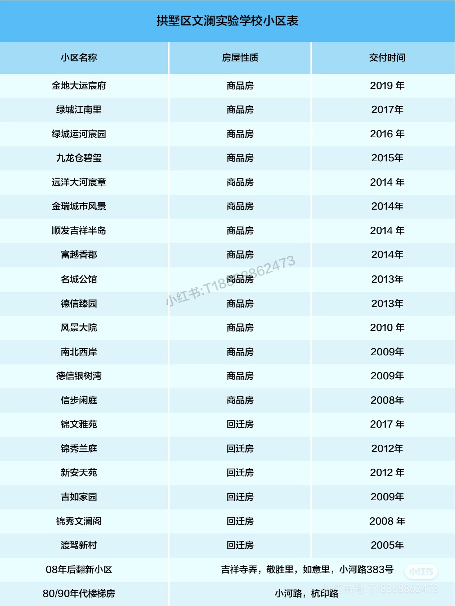
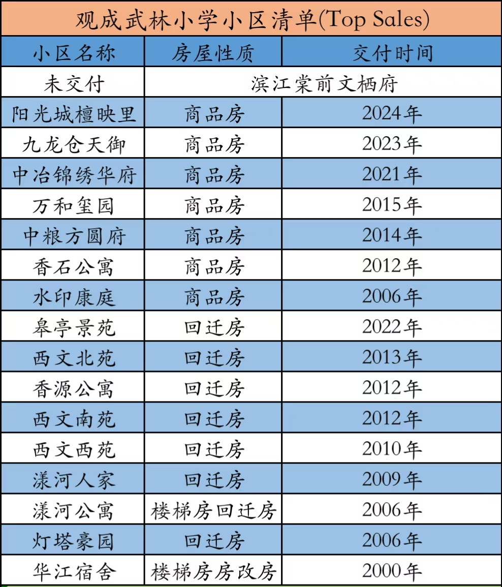

# 学区房

## 需求

* 双一流学区
  * 尽可能离学校近一点（尤其是小学）
* 自住不考虑老破小和回迁房，楼盘交付至今最好不超过 10 年
* 上下班通勤时间不超过 30min
  * 优先考虑吴家厍距离
* 总价不超过 600w

## 选房逻辑

1. 政策解读、趋势分析
2. 为了进入重高，初中比小学关键的多，所以先确定目标初中
3. 根据目标初中确定目标小学，即确定目标学区
4. 整理各目标学区的可选择楼盘
5. 实地考察、权衡利弊

## 基本概念

> 基本概念澄清 & 当前政策整理

### 学籍占用



<figure><figcaption></figcaption></figure>



<figure><figcaption></figcaption></figure>



<figure><figcaption></figcaption></figure>



### 民办 vs 公办



<figure><figcaption></figcaption></figure>



<figure><figcaption></figcaption></figure>



<figure><figcaption></figcaption></figure>



<figure><figcaption></figcaption></figure>



<figure><figcaption></figcaption></figure>



### 表批划分

> 表批的划分只针对公办入学

<figure><figcaption></figcaption></figure>

### 分配生



<figure><figcaption></figcaption></figure>



<figure><figcaption></figcaption></figure>



<figure><figcaption></figcaption></figure>



### 预警状态

> 浙里办-入学早知道，每年年底更新。

<figure><figcaption></figcaption></figure>

## 趋势分析

> 争取回答：1. 何时买房; 2. 买什么房

### 人口趋势



<figure><figcaption></figcaption></figure>



<figure><figcaption></figcaption></figure>



<figure><figcaption></figcaption></figure>



主要关注杭州市主城区近十年出生人数：

<figure><figcaption></figcaption></figure>

也就是说 2023/2024/2025 幼升小的数量大致为 92571/80238/78168，而到了 2029 年则约为 59620、相比于 2024 年下降 25.7%.

### 入学难度

从两方面考虑：

* 生源数量：如上所述，相比于现在会大幅减少，但对头部学区冲击相对较小
* 经济环境：经济下滑，教育投入趋于谨慎，学区竞争缓解

所以从上面两个角度来看，到 2029 年入学难度很大可能会下降，头部学区对落户时间的要求大幅降低甚至不再分流，而尾部学区甚至会面临招不满的情况。

因此，即使是头部学区如文澜学区（2024 年落户要求 3.5 年），对于 4 年后 2029 年幼升小的家庭来说似乎也没必要急着落户，可以先关注下 2025 年 12 月更新后的学区预警状态再决定。但为了保险起见，也不宜过晚购买。

### 政策走向

> 纯个人看法，仅供参考。

国家的政策方向是确定的即“教育平等”，杭州为了响应该政策把分配生比例上调到了 70%，这意味着头部初中本来能通过裸考拿到的重高名额的一部分被强制分给了非头部初中，让更多“学渣”能享受到高质量的高中教学。换个角度来看，头部初中的竞争会变得更加激烈，会导致部分家长转向二流初中通过分配生这个机制来进入重高，这也就直接降低了头部学区的性价比。

### 应对策略

本质上看，“学区”是教育资源集中的产物，和“教育平等”是背道而驰的，所以从长期来看“学区”的概念会越来越弱（即使出生率不像现在这样持续走低），但政策变化一般会有个过渡期（比如民转公，按照杭州教育局的说法是存在过渡期，在具体执行上“一校一策”，不一定是三年），而个人认为进入这个过渡期的标志就是学校开始招不满。由于像文澜这样的顶级学区的热度依然很高（2027 年仍然红色预警），所以最快可能也要到 2029 年左右才会开始进入过渡期。为了不引起民愤，过渡期很大可能还是会保留“学区”的作用，即优先（可能是在一定程度上，也可能是无条件优先）本学区生源，对于招不满的部分再开放给学区外摇号。所以对于 2029 年幼升小的家庭来说，仍然需要准备好学区房。

那么应该买什么学区房？买“老破小”主要是为了落户到学区，那么根据学籍占用规则最早也要到孩子读了初一之后才能卖，所以至少要在 2029 年幼升小后继续持有 6+ 年，这期间政策转变的“过渡期”很可能已经结束，使得“老破小”的学区属性彻底消失而变得一文不值（这些房子不具备居住属性），所以到时候基本不太可能脱手、造成巨大的经济损失。居住品质较差的回迁房同理。

如果不考虑老破小和回迁房，那就只有商品房了，该如何选择？道理应该是一样的，除去学区的附加价值就只剩下居住的价值，这里面包括房子本身的质量、小区的环境、交通以及周边配套等。桥西板块虽然不如武林、申花，但整体上还是适合居住的，在杭州也算是中上水平，所以剩下就是看房子和楼盘本身了，应该在预算范围内尽量选择开发商好、房龄短的优质房源。

## 具体方案

> 逻辑：选初中 -> 定小学/学区 -> 找房

### 学校

下面是 2024 年按重高录取率排序的中考成绩，包括分配生和裸考生。之所以参考这个排名是因为欣然不一定能成为考进前三的尖子生，而重高是一般人都可以企及的。

<figure><figcaption></figcaption></figure>

考虑到通勤距离，只能考虑 拱墅区 和 西湖区，其中民办中学主要是拱墅区的育才中学和西湖区的公益中学，后者通勤距离太长不考虑，所以民办只考虑育才。然后考虑到学校的教育水平，这两个区的可选公办初中如下：

* 拱墅区
  * 文澜实验中学：文澜中学民转公后与文澜实验中学混班教学，所以本质上是同一所学校
  * 观成武林：23 年有掐尖所以表现突出，但 24 年表现仍然抢眼，是否能够持续是个风险
    * 观成武林和观成实验从 2024 年开始混班教学，质量可能进一步下滑
    * 据说 2024 届毕业生当年仍然有掐尖，只是没 2023 届掐的那么彻底
  * 大关实验：近年来表现一般，可作为备胎
* 西湖区
  * 十三中：传统强校，但分校后师资力量可能会被打散
    * 文三分校：后续接纳 学军求智 和 文三街小学 生源
  * 保俶塔申花：九年一贯传统强校
  * 文华：生源质量高（星洲小学），但初中水平没那么拔尖

公办初中详细对比如下：

<table><thead><tr><th width="119.6265869140625">初中</th><th width="119.57489013671875">前三率</th><th width="119.987060546875">重高率</th><th width="119.5367431640625">小学</th><th>小学部至吴家舍</th><th>小学部至蚂蚁</th></tr></thead><tbody><tr><td>育才</td><td><mark style="color:red;">8.39%</mark></td><td><mark style="color:green;">33.33%</mark></td><td>锦绣育才</td><td><mark style="color:green;">5.3km</mark> / 15min</td><td>6.1km / 15min</td></tr><tr><td>文澜实验</td><td>10.48%</td><td>30.76%</td><td>文澜实验</td><td><mark style="color:green;">4.2km</mark> / <mark style="color:green;">12min</mark></td><td>8.4km / 22min</td></tr><tr><td>观成武林</td><td><mark style="color:green;">15.73%</mark></td><td>31.46%</td><td>观成武林 /  长江实验</td><td>8.8km / <mark style="color:yellow;">17min</mark> <mark style="color:red;">13km</mark> / <mark style="color:red;">24min</mark></td><td>11km / 22min 6.3km / 17min</td></tr><tr><td>大关实验</td><td><mark style="color:red;">8.86%</mark></td><td><mark style="color:red;">29.52%</mark></td><td>卖小 (本部)</td><td><mark style="color:red;">11km</mark> / <mark style="color:yellow;">19min</mark></td><td>7.7km / 17min</td></tr><tr><td>十三中</td><td>10.27%</td><td><mark style="color:green;">34.96%</mark></td><td>行知 /          文一街</td><td>8.1km / <mark style="color:red;">24min 11km</mark> / <mark style="color:yellow;">19min</mark></td><td>4.7km / 12min 7.3km / 15min</td></tr><tr><td>文三中学</td><td>(同十三中)</td><td>(同十三中)</td><td>学军 (求智) / 文三街</td><td><mark style="color:red;">12km</mark> / <mark style="color:red;">21min 13km</mark> / <mark style="color:red;">23min</mark></td><td>5.5km / 15min 5.6km / 15min</td></tr><tr><td>保申</td><td>10.66%</td><td>31.98%</td><td>保申</td><td>6.4km / 16min</td><td>5.4km / 15min</td></tr><tr><td>文华</td><td><mark style="color:red;">8.90%</mark></td><td>31.85%</td><td>星洲</td><td><mark style="color:red;">11km</mark> / <mark style="color:red;">21min</mark></td><td>3.7km / 11min</td></tr></tbody></table>

在通勤这块，个人认为“时间”比“距离”更关键，因为从体感上看是：

|     | 距离长    | 距离短 |
| --- | ------ | --- |
| 耗时长 | 身体累、心累 | 心累  |
| 耗时短 | 开得爽    | 没感觉 |

其次，领导通勤是要优先考虑的，对指标做 3(吴家舍):1(蚂蚁) 加权平均后得到：

<figure><figcaption></figcaption></figure>

可以得到以下结论：

* 如下表所示，育才系摇号会有很大的不确定性，需要合适的方案兜底。
  * 可以在育才登云小学兜底，但它在申花板块，购房超过预算。
    * 如果不能在学校门口买房，上下学时间成本也很大，甚至超过购房成本。
  * 如果选择好学区兜底，不如直接读那个学区的公办。
  * 九年下来预计需要大几十万甚至百万预算，性价比不高。
* “卖小+大关实验”和“星洲+文华”这两个组合教育质量和通勤距离都不占优势，可以淘汰。
* 长江实验小学通勤非常不便，且有观成武林小学上位替代，可被排除。
* 十三中各对口小学均通勤不便，且教育资源将被打散到文三中学，可以放弃。

|      | 观成实验(民转公) | 锦绣育才 | 育才中学 | 锦绣中学 |
| ---- | --------- | ---- | ---- | ---- |
| 2025 | 8.82      | 3.75 | 2.26 | 1.61 |
| 2024 | 8.36      | 3.82 | 1.96 | 1.61 |
| 2023 | 6.80      | 6.06 | 2.44 | 2.18 |
| 2022 | 4.96      | 4.36 | 2.52 | 2.19 |

那么最终胜出的方案如下（均为九年一贯制公办学校）：

<figure><figcaption>
通勤方位图
</figcaption></figure>

<table><thead><tr><th width="110.1229248046875"></th><th width="106.4017333984375">2027</th><th width="106.3072509765625">2026</th><th width="106.122314453125">2025</th><th width="105.9061279296875">2024</th><th width="106.4136962890625">2023</th><th width="106.0728759765625">2022</th></tr></thead><tbody><tr><td>文澜实验</td><td><mark style="color:red;">红</mark></td><td><mark style="color:red;">红</mark></td><td><mark style="color:red;">红</mark></td><td>无分流</td><td>无分流</td><td>2020/3/3</td></tr><tr><td>保俶塔申花</td><td><mark style="color:green;">绿</mark></td><td><mark style="color:green;">绿</mark></td><td><mark style="color:yellow;">黄</mark></td><td>无分流</td><td>无分流</td><td>无分流</td></tr><tr><td>观成武林</td><td><mark style="color:green;">绿</mark></td><td><mark style="color:red;">红</mark></td><td><mark style="color:red;">红</mark></td><td>无分流</td><td>无分流</td><td>无分流</td></tr></tbody></table>

### 学区

> 从学区内楼盘的情况来筛选学区。

#### 文澜实验

<figure><figcaption></figcaption></figure> <figure><figcaption>
未在左图中标注的小区均为老破小
</figcaption></figure>

<figure><figcaption></figcaption></figure>

#### 观成武林

<figure><figcaption></figcaption></figure> <figure><figcaption></figcaption></figure>

<figure><figcaption></figcaption></figure>

#### 保俶塔申花

<figure><figcaption></figcaption></figure> <figure><figcaption></figcaption></figure>

<figure><figcaption></figcaption></figure>

都是老破小，该学区可彻底排除。

### 楼盘

最终只考虑文澜实验和观成武林这两个学区，而文澜实验所在的桥西板块的城市界面显著优于观成武林所在的三塘板块，所以优先考虑文澜。这两个学区内房龄在十年及以内的商品房如下：

<table><thead><tr><th></th><th>开发商</th><th>物业</th><th>交付年份</th><th width="181.321533203125">户型</th><th>总户数</th><th>单价(估)</th><th>开盘价</th><th>容积率</th><th>外立面</th><th width="350.3902587890625">备注</th></tr></thead><tbody><tr><td><mark style="background-color:red;">(文澜实验)</mark></td><td></td><td></td><td></td><td></td><td></td><td></td><td></td><td></td><td></td><td></td></tr><tr><td>大运宸府</td><td>金地</td><td>绿城 (前:金地)</td><td>2019.12</td><td>102/<mark style="color:green;">116</mark>/128/139</td><td>595</td><td>62000</td><td>48000</td><td>2.79</td><td>铝板+石材</td><td>学区最北，3幢北临高架，车库差</td></tr><tr><td>运河宸园</td><td>奥诚/绿城</td><td>绿城</td><td>2016.12</td><td>89/<mark style="color:green;">124</mark>/136/180+</td><td>912</td><td>63700</td><td>30000</td><td>2.1</td><td>玻璃+石材</td><td>公认高品质，离学校略远，落地玻璃</td></tr><tr><td>碧玺 (高层)</td><td>港盈 &#x26; 九龙仓</td><td><mark style="color:red;">万科</mark></td><td>2015</td><td>83/89/132/188</td><td>1600</td><td>55800</td><td>24000</td><td>2.1</td><td><mark style="color:red;">涂料</mark></td><td>文澜实验旁边，<mark style="color:red;">楼间距小</mark>，<mark style="color:red;">楼盘质量差</mark></td></tr><tr><td>城市风景</td><td>金瑞</td><td>绿城</td><td>2014</td><td>88/120/137/143/178</td><td>426</td><td>43500</td><td>22000</td><td>2.7</td><td>干挂石材</td><td>交通便利，品质不错，得房率高，小区很小</td></tr><tr><td>名城公馆</td><td>名城北部</td><td><mark style="color:red;">万科</mark></td><td><mark style="color:red;">2013</mark></td><td>80/89/120/125/132</td><td>920</td><td>49000</td><td>19000</td><td>2.5</td><td>干挂石材</td><td><mark style="color:red;">离学校较远</mark>，得房高，小区空间大，间距合理</td></tr><tr><td><mark style="background-color:red;">(观成武林)</mark></td><td></td><td></td><td></td><td></td><td></td><td></td><td></td><td></td><td></td><td></td></tr><tr><td>润百合</td><td></td><td></td><td></td><td></td><td></td><td></td><td></td><td></td><td></td><td></td></tr><tr><td>阳光城檀映里</td><td>碧光</td><td>阳光城</td><td>2024</td><td>115-142</td><td>400</td><td>54100</td><td>47000</td><td>2.4</td><td></td><td></td></tr><tr><td>御尚华庭</td><td>九龙仓</td><td>九龙仓</td><td>2023</td><td>137-197</td><td>206</td><td>48100</td><td></td><td>2.8</td><td></td><td>据说是坑</td></tr><tr><td>锦绣华府</td><td>中冶</td><td>中冶</td><td>2021</td><td>119/129/139</td><td>502</td><td>46400</td><td></td><td>3</td><td></td><td></td></tr><tr><td>万和玺园</td><td>万恒</td><td>彩虹</td><td>2015</td><td>71/89-139/260(跃)</td><td>960</td><td>58000</td><td>24000</td><td>2.5</td><td></td><td></td></tr><tr><td>中粮方圆府</td><td>鸿悦</td><td>中粮</td><td>2014</td><td>89/120/133</td><td>640</td><td>31100</td><td>20000</td><td>2.7</td><td></td><td></td></tr><tr><td>香石公寓</td><td>恒润</td><td>南都</td><td><mark style="color:red;">2012</mark></td><td>89/131/139</td><td>480</td><td>41900</td><td>23500</td><td>2.2</td><td></td><td></td></tr><tr><td><mark style="background-color:red;">(淘汰楼盘)</mark></td><td></td><td></td><td></td><td></td><td></td><td></td><td></td><td></td><td></td><td></td></tr><tr><td>江南里(别墅)</td><td>绿城</td><td>绿城</td><td>2017</td><td><mark style="color:red;">200</mark>-800</td><td>56</td><td></td><td></td><td>0.7</td><td></td><td></td></tr><tr><td>大河宸章</td><td>远洋</td><td>远洋</td><td>2014.8</td><td>89/<mark style="color:red;">170</mark>/194/224</td><td>790</td><td>67100</td><td>30000</td><td>2.33</td><td>干挂石材</td><td>逼格高、绿化好，桥西中心，小学对面，<mark style="color:red;">89方户型很差</mark></td></tr><tr><td>吉祥半岛</td><td>吉顺</td><td>绿城</td><td>2014</td><td>75/85/88/123/131</td><td>1137</td><td>49700</td><td>22000</td><td>2.5</td><td>干挂石材</td><td>得房率高，整体设施好，伪人车分流，噪音大，<mark style="color:red;">传言会划出文澜学区</mark></td></tr><tr><td>富越香郡</td><td>中瑞</td><td>南都</td><td>2014</td><td>88/90/110/118</td><td>996</td><td>36000</td><td>18000</td><td>3</td><td></td><td><mark style="color:red;">上学远 (划出学区风险?)</mark></td></tr><tr><td>德信臻园</td><td>德信汇运</td><td>盛全</td><td>2013.11</td><td><mark style="color:red;">160</mark>/164/169/200</td><td>300</td><td>62100</td><td>33000</td><td>2.5</td><td></td><td></td></tr><tr><td>棠前文栖</td><td>滨西</td><td></td><td>2025</td><td>139-194</td><td></td><td>47800</td><td></td><td>2.5</td><td>3铝+1涂</td><td>新盘<mark style="color:red;">已清盘</mark>，绿化率 35%，人车不分流，公租房 5%，得房率 78%</td></tr><tr><td></td><td></td><td></td><td></td><td></td><td></td><td></td><td></td><td></td><td></td><td></td></tr></tbody></table>

TODO：新楼盘

## 购买细节

